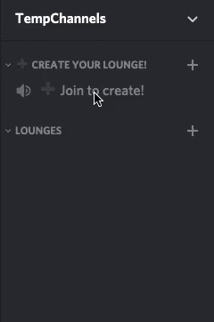

# Discord Temporary Voice Channels

Discord Temp Channels is a framework to facilitate the creation of a temporary voice channels system using Discord.js!

## Installation

```sh
npm install --save discord-temp-channels
```

## Example

### Code

```js
const Discord = require("discord.js");
const client = new Discord.Client();

const TempChannels = require("discord-temp-channels");
const tempChannels = new TempChannels(client);

// Register a new main channel
tempChannels.registerChannel("channel-id", {
    childCategory: "category-id",
    childAutoDeleteIfEmpty: true,
    childMaxUsers: 3,
    childFormat: (member, count) => `#${count} | ${member.user.username}'s lounge`
});

client.login("YOUR_TOKEN");
```

### Result



## Methods

### Register Channel

You have to register a channel to indicate to the package which channel will be used to create child channels.

```js
// Register a new parent channel
tempChannels.registerChannel("channel-id", {
    childCategory: "category-id",
    childAutoDeleteIfEmpty: true,
    childAutoDeleteIfOwnerLeaves: true,
    childMaxUsers: 3,
    childBitrate: 64000,
    childFormat: (member, count) => `#${count} | ${member.user.username}'s lounge`
});
```

**channelID**: The ID of the channel the users will have to join to create a new channel.

**options.childCategory**: Optional - This will be the category ID in which the new channels will be created.  
**options.childAutoDeleteIfEmpty**: Whether, when a channel is empty, it should be deleted.  
**options.childAutoDeleteIfOwnerLeaves**: Whether, when the member who created a channel left it, it should be deleted.  
**options.childMaxUsers**: Optional - This will be the maximum number of users that can join a channel  
**options.childBitrate**: Optional - This will be the new channel bitrate  
**options.childFormat**: This is a function which takes two parameters: the member (the one who created the channel, and the number of voice channels created from the same parent channel)  

### Un-Register Channel

You can un-register a channel, so the users who join the it won't create a new channel.

```js
// Unregister a parent channel
tempChannels.unregisterChannel("channel-id");
```

**channelID**: The ID of the channel you want unregister.

### Events

```js
// Emitted when a child channel is created
tempChannels.on("childCreate", (member, channel, parentChannel) => {
    console.log(member); // The member who created the new channel
    console.log(channel); // The channel which was created
    console.log(parentChannel); // The channel the member joined to create the new channel
});

// Emitted when a child channel is deleted
tempChannels.on("childDelete", (member, channel, parentChannel) => {
    console.log(member); // The member who caused the deletion of the channel
    console.log(channel); // The channel which was deleted
    console.log(paretnChannel); // The channel the member joined to create the deleted channel
});

// Emitted when a channels is registered
tempChannels.on("channelRegister", (channelData) => {
    console.log(channelData);
    /*
    {
        "channelID": "03909309383083"
        "options": {
            "childCategory": "380398303838398390",
            "childAutoDeleteIfEmpty": true
            etc...
        }
    }
    */
});

// Emitted when a channels is unregistered
tempChannels.on("channelUnregister", (channelData) => {
    console.log(channelData);
    /*
    {
        "channelID": "03909309383083"
        "options": {
            "childCategory": "380398303838398390",
            "childAutoDeleteIfEmpty": true
            etc...
        }
    }
    */
});

// Emitted when there is an error
tempChannels.on("error", (err, message) => {
    console.log(err);
    console.log(message);
});
```

## Bot Example

This code stores temporary channels data in a database (quick.db in this case). When the bot starts, it registers all the channels in the database and there is a command to add new main channels (!set).

```js
const Discord = require("discord.js");
const client = new Discord.Client();

const TempChannels = require("discord-temp-channels");
const tempChannels = new TempChannels(client);

const db = require("quick.db");

client.on("ready", () => {
    db.get("temp-channels").forEach((channelData) => {
        tempChannels.registerChannel(channelData.channelID, channelData.options);
    });
});

client.on("message", (message) => {

    if(message.content.startsWith("!set")){
        if(tempChannels.channels.some((channel) => channel.channelID === message.member.voice.channel.id)){
            return message.channel.send("Your voice channel is already a main voice channel");
        }
        const options = {
            childAutoDeleteIfEmpty: true,
            childAutoDeleteIfOwnerLeaves: true,
            childMaxUsers: 3,
            childBitrate: 64000,
            childFormat: (member, count) => `#${count} | ${member.user.username}'s lounge`
        };
        tempChannels.registerChannel(message.member.voice.channel.id, options);
        db.push("temp-channels", {
            channelID: message.member.voice.channel.id,
            options: options
        });
        message.channel.send("Your voice is now a main voice channel!");
    }

});

client.login("YOUR_TOKEN");
```
